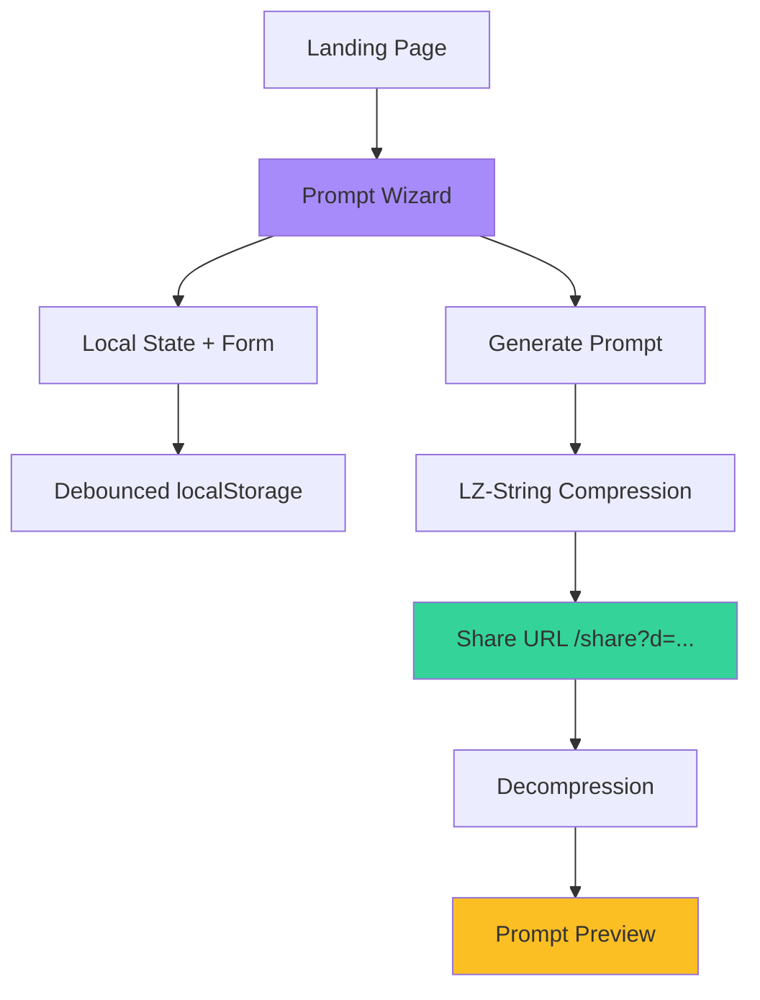

# Prompt Builder AI 🚀

A wizard-based web app for building structured AI prompts with shareable URLs and real-time preview.

## 🎯 Why & What Problems it Solves

Building effective AI prompts is challenging—users often forget key context, struggle with structure, or can't easily share their prompts. This tool solves these problems by:

- **Guided Structure**: 10-step wizard ensures comprehensive, well-formed prompts
- **Shareable URLs**: Compressed URLs (TypeScript Playground-style) for easy collaboration
- **No Sign-up Required**: Client-side only, privacy-first approach with localStorage
- **Instant Preview**: Real-time formatted output shows exactly what the AI will receive

## 🏗️ Architecture



**Flow**:

1. User fills wizard form (React state + TanStack Form)
2. Changes auto-save to localStorage (debounced)
3. On "Finish", data compresses to URL-safe string (LZ-String)
4. Share URL renders read-only preview from compressed data

**Key Design Decisions**:

- **Client-side only**: No backend, all data in URLs/localStorage
- **Compression**: Only non-default values stored to minimize URL length
- **File-based routing**: TanStack Router for type-safe navigation

## 🛠️ Tech Stack

| Layer           | Technology                 | Purpose                             |
| --------------- | -------------------------- | ----------------------------------- |
| **Framework**   | React 19 + TypeScript 5    | Type-safe UI components             |
| **Routing**     | TanStack Router v1         | File-based, type-safe routing       |
| **Forms**       | TanStack Form + Zod        | Form state + validation             |
| **Styling**     | Tailwind CSS 4 + Radix UI  | Neobrutalist design system          |
| **Compression** | LZ-String                  | URL-safe prompt sharing             |
| **Build**       | Vite 7                     | Fast dev server + bundling          |
| **Quality**     | TypeScript + Knip + Vitest | Type safety + unused code detection |

## 🚀 Quick Start

```bash
pnpm install  # Install dependencies
pnpm dev      # Start dev server (port 3000)
pnpm lint     # Type check + unused code detection
```

## 📁 Project Structure

```
src/
├── routes/
│   ├── wizard.tsx              # Main wizard (/wizard)
│   └── share.tsx               # Shared prompts (/share?d=...)
├── components/prompt-wizard/   # Wizard steps + preview
├── utils/prompt-wizard/        # Compression + schema + validation
└── components/ui/              # Shadcn/ui components
```

## 📄 License

MIT

---

**Built with modern web technologies** ⚡
