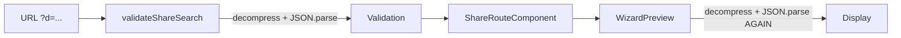

# Route Inefficiency Analysis

Analysis of `/wizard` and `/share` routes and their child components.

---

## Summary

| Category              | Count | Severity  |
| --------------------- | ----- | --------- |
| Duplicate Computation | 3     | 🔴 High   |
| Re-render Issues      | 4     | 🟠 Medium |
| Memory/Closure Issues | 2     | 🟠 Medium |
| Architectural         | 3     | 🟡 Low    |

---

## 🔴 High Priority Issues

### 1. Double Decompression in Share Route

**Location:** [share.tsx](file:///Users/santoshvenkatraman/Personal/Coding/builder-prompt-ai/src/routes/share.tsx) + [WizardPreview.tsx](file:///Users/santoshvenkatraman/Personal/Coding/builder-prompt-ai/src/components/prompt-wizard/WizardPreview.tsx)



**Problem:** Data is decompressed twice:

1. In `validateShareSearch()` (lines 21-26 of share.tsx)
2. In `WizardPreview` useMemo (lines 64-85 of WizardPreview.tsx)

**Fix:** Pass the already-parsed `PromptWizardData` from route validation instead of raw compressed string.

---

### 2. Redundant `compressFullState` on Every Render

**Location:** [WizardPreview.tsx:91](file:///Users/santoshvenkatraman/Personal/Coding/builder-prompt-ai/src/components/prompt-wizard/WizardPreview.tsx#L91)

```typescript
// Called on every data change, even when not needed
return [generatePromptText(wizardData), wizardData, compressFullState(wizardData)];
```

**Problem:** `compressFullState()` runs on every wizard data update, but `promptTextCompressed` is only used when user clicks "Copy Link" or "Open/Edit".

**Fix:** Defer compression to button click handlers using lazy evaluation.

---

### 3. `useMemo` Dependencies Missing `trackEvent`

**Location:** [WizardPreview.tsx:92](file:///Users/santoshvenkatraman/Personal/Coding/builder-prompt-ai/src/components/prompt-wizard/WizardPreview.tsx#L62-92)

```typescript
const [promptText, wizardData, promptTextCompressed] = useMemo(() => {
  // ... calls trackEvent inside ...
}, [data, compressed]); // ❌ Missing trackEvent, analyticsWrapper
```

**Problem:** Side effects (`trackEvent`) inside `useMemo` violate React patterns and could cause stale closure issues.

**Fix:** Move analytics tracking to `useEffect`.

---

## 🟠 Medium Priority Issues

### 4. Excessive Zustand Selector Calls

**Location:** [PromptWizard.tsx:87-99](file:///Users/santoshvenkatraman/Personal/Coding/builder-prompt-ai/src/components/prompt-wizard/PromptWizard.tsx#L87-99)

```typescript
const wizardData = useWizardStore((state) => state.wizardData);
const shareUrl = useWizardStore((state) => state.shareUrl);
const showError = useWizardStore((state) => state.showError);
const updateData = useWizardStore((state) => state.updateData);
// ... 9 more selectors
```

**Problem:** 12 individual `useWizardStore` calls. While selectors prevent re-renders, each creates a separate subscription.

**Fix:** Group related state into a single selector with `useShallow`:

```typescript
import { useShallow } from "zustand/react/shallow";

const { wizardData, shareUrl, showError } = useWizardStore(
  useShallow((state) => ({
    wizardData: state.wizardData,
    shareUrl: state.shareUrl,
    showError: state.showError,
  }))
);
```

---

### 5. `completedSteps` Set Recreated Every Render

**Location:** [PromptWizard.tsx:168-175](file:///Users/santoshvenkatraman/Personal/Coding/builder-prompt-ai/src/components/prompt-wizard/PromptWizard.tsx#L168-175)

```typescript
const completedSteps = useMemo(() => {
  const completed = new Set<number>();
  if (taskIntentValid) completed.add(1);
  for (let i = 2; i <= totalSteps; i++) {
    completed.add(i); // Adds ALL steps 2-10 as "completed"
  }
  return completed;
}, [taskIntentValid, totalSteps]);
```

**Problem:** Logic marks steps 2-10 as always complete, making `completedSteps` meaningless. The `currentMaxStep` now handles progress tracking, making this redundant.

**Fix:** Remove `completedSteps` or fix logic to reflect actual completion state.

---

### 6. Framer Motion Layout Thrashing

**Location:** [WizardProgress.tsx:38-46](file:///Users/santoshvenkatraman/Personal/Coding/builder-prompt-ai/src/components/prompt-wizard/WizardProgress.tsx#L38-46)

```typescript
<motion.div
  className="grid items-center gap-2 mb-4"
  style={{
    gridTemplateColumns: steps
      .map((_, i) => (i < steps.length - 1 ? "auto 1fr" : "auto"))
      .join(" "),  // Computed on every render
  }}
  layout  // ⚠️ Triggers layout animation on style change
```

**Problem:** Dynamic `gridTemplateColumns` + `layout` prop causes expensive layout recalculations when toggling advanced mode.

**Fix:** Use CSS classes or memoize the grid style.

---

### 7. Nested Animation Wrappers

**Location:** [PromptWizard.tsx:269-278](file:///Users/santoshvenkatraman/Personal/Coding/builder-prompt-ai/src/components/prompt-wizard/PromptWizard.tsx#L269-278)

```typescript
<motion.div initial={{ opacity: 0, y: 20 }} animate={{ opacity: 1, y: 0 }}>
  <motion.div initial={{ opacity: 0, y: 20 }} animate={{ opacity: 1, y: 0 }}>
    {/* Wizard Card */}
```

**Problem:** Parent and child have identical animations that run simultaneously, wasting GPU cycles.

**Fix:** Remove duplicate animation from child or use `motion.div` inheritance.

---

## 🟡 Low Priority Issues

### 8. `window.location` in useMemo

**Location:** [share.tsx:56-61](file:///Users/santoshvenkatraman/Personal/Coding/builder-prompt-ai/src/routes/share.tsx#L56-61)

```typescript
const shareUrl = useMemo(() => {
  if (typeof window !== "undefined") {
    return window.location.pathname + window.location.search;
  }
  return null;
}, []); // Empty deps - never updates
```

**Problem:** Won't update if URL changes without remount. Also, `window` check is for SSR but TanStack Router already provides the search params.

**Fix:** Use `useSearch` result directly: `const shareUrl = d ? `/share?d=${d}` : null`

---

### 9. Console Logs in Production

**Location:** [wizard-store.ts:116-157](file:///Users/santoshvenkatraman/Personal/Coding/builder-prompt-ai/src/stores/wizard-store.ts#L116-157)

```typescript
export function generatePromptText(finalData: PromptWizardData): string {
  console.group("generatePromptText", finalData);
  // ... many console.log calls
  console.groupEnd();
```

**Problem:** Debug logging in hot path will impact performance in production.

**Fix:** Remove or wrap in `process.env.NODE_ENV !== 'production'` check.

---

### 10. Unused `navigate` Import

**Location:** [share.tsx:53](file:///Users/santoshvenkatraman/Personal/Coding/builder-prompt-ai/src/routes/share.tsx#L53)

```typescript
const navigate = useNavigate({ from: "/share" });
```

Only used inside `onClose` callback passed to `WizardPreview`. Could be passed as a prop instead.

---

## Recommended Refactoring Priority

1. **Fix double decompression** — Biggest performance win
2. **Lazy compression** — Defer `compressFullState` to user action
3. **Remove console logs** — Quick win
4. **Group Zustand selectors** — Cleaner code + fewer subscriptions
5. **Fix `useMemo` side effects** — React best practice
