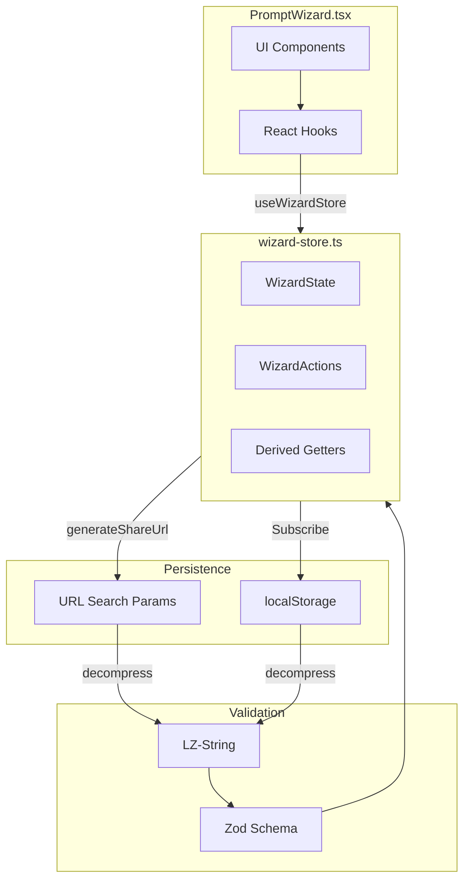
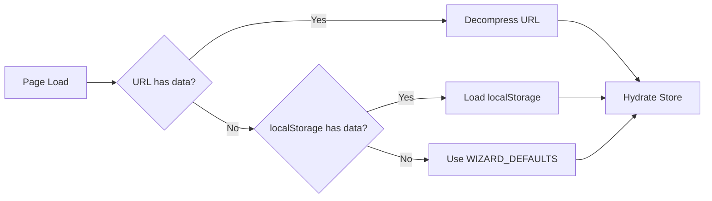

# State Management Architecture

## Overview

The PromptWizard component uses **Zustand** as its centralized state management solution, combined with URL persistence and localStorage for data durability. This architecture enables shareable prompt URLs and offline draft recovery.

---

## Architecture Diagram



---

## Core Components

### 1. Zustand Store ([wizard-store.ts](file:///Users/santoshvenkatraman/Personal/Coding/builder-prompt-ai/src/stores/wizard-store.ts))

The store manages all wizard state with a clean separation between state, actions, and derived values.

#### State Shape

```typescript
interface WizardState {
  wizardData: PromptWizardData; // Form data
  shareUrl: string | null; // Generated share URL
  showError: boolean; // Validation error visibility
  dataSource: "default" | "localStorage" | "url"; // Data origin
}
```

#### Actions

| Action         | Description                             |
| -------------- | --------------------------------------- |
| `initialize()` | Hydrates store from URL or localStorage |
| `updateData()` | Updates wizard form fields              |
| `goToStep()`   | Navigates between wizard steps          |
| `finish()`     | Generates final share URL               |
| `reset()`      | Clears all data and storage             |

#### Derived Getters

| Getter                  | Purpose                          |
| ----------------------- | -------------------------------- |
| `getPromptText()`       | Generates final prompt markdown  |
| `getCompressedData()`   | Returns LZ-compressed form data  |
| `isCurrentStepValid()`  | Step-specific validation         |
| `getCurrentStepError()` | Returns validation error message |

---

### 2. Data Schema ([schema.ts](file:///Users/santoshvenkatraman/Personal/Coding/builder-prompt-ai/src/utils/prompt-wizard/schema.ts))

Zod-based validation ensures type-safe data throughout the app.

```typescript
interface PromptWizardData {
  // Required (Steps 1-5)
  task_intent: string;
  context: string;
  constraints: string;
  target_audience: TargetAudience;
  output_format: OutputFormat;

  // Optional (Steps 6-10)
  ai_role?: string;
  tone_style?: ToneStyle;
  reasoning_depth: ReasoningDepth;
  self_check: boolean;
  disallowed_content?: string;

  // Wizard state
  step: number;
}
```

---

## Data Flow

### Initialization Priority



> [!IMPORTANT]
> **URL takes precedence** over localStorage. This enables reliable prompt sharing.

### Persistence Flow

1. **User edits** → `updateData()` action
2. **Store updates** → Subscriber fires (debounced 300ms)
3. **Auto-save** → LZ-compressed to localStorage
4. **Step change** → Regenerates share URL

---

## URL Compression

Uses [lz-string](https://github.com/pieroxy/lz-string) for TypeScript Playground-style URLs.

| Feature                 | Benefit             |
| ----------------------- | ------------------- |
| Base64 encoding         | URL-safe characters |
| ~30-50% size reduction  | Shorter share links |
| Only non-default values | Minimal URL length  |

**Example URL:**

```
/wizard?d=N4IgLg9gJgpgThCA...&vld=1
```

---

## Component Integration

The PromptWizard component uses **selector patterns** to minimize re-renders:

```typescript
// Individual selectors prevent unnecessary re-renders
const wizardData = useWizardStore((state) => state.wizardData);
const updateData = useWizardStore((state) => state.updateData);
const isCurrentStepValid = useWizardStore((state) => state.isCurrentStepValid);
```

### Key Patterns Used

- **Memoization**: `React.memo()` on main component
- **Stable callbacks**: `useCallback` for all handlers
- **Derived values**: `useMemo` for computed properties
- **Ref for init guard**: Prevents double initialization

---

## Key Design Decisions

| Decision              | Rationale                                            |
| --------------------- | ---------------------------------------------------- |
| Zustand over Context  | Simpler API, better performance, no provider nesting |
| LZ-String compression | Enables long prompts in shareable URLs               |
| Debounced persistence | Reduces localStorage writes on rapid typing          |
| URL-first hydration   | Shared links override local drafts                   |
| Zod validation        | Runtime type safety + schema inference               |
